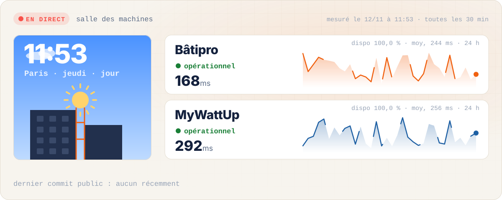
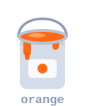
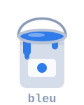
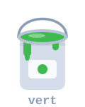
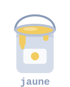
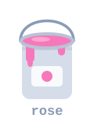
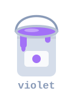
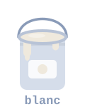

<picture>
  <source media="(prefers-color-scheme: dark)" srcset="./assets/hero-dark.svg" />
  
</picture>

  <picture>
    <source media="(prefers-color-scheme: dark)" srcset="https://mmr45-profil.vercel.app/terminal.svg?theme=dark" />
    
  </picture>

  

 

<picture>
  <source media="(prefers-color-scheme: dark)" srcset="./assets/titre-01-dark.svg" />
  
</picture>

  <a href="https://batipro-ten.vercel.app"><picture>
  <source media="(prefers-color-scheme: dark)" srcset="./assets/projet-batipro-dark.svg" />
  
</picture></a>

 

  <a href="https://my-watt-up.vercel.app"><picture>
  <source media="(prefers-color-scheme: dark)" srcset="./assets/projet-mywattup-dark.svg" />
  
</picture></a>

 

  <picture>
    <source media="(prefers-color-scheme: dark)" srcset="https://raw.githubusercontent.com/mmr45/mmr45/live/live-dark.svg" />
    
  </picture>

 

<picture>
  <source media="(prefers-color-scheme: dark)" srcset="./assets/titre-02-dark.svg" />
  
</picture>

  <picture>
  <source media="(prefers-color-scheme: dark)" srcset="./assets/archi-dark.svg" />
  
</picture>

  <picture>
    <source media="(prefers-color-scheme: dark)" srcset="https://skillicons.dev/icons?i=ts,js,vue,tailwind,html,css,nodejs,supabase,postgres,vercel,git,github&perline=12&theme=dark" />
    
  </picture>

 

<picture>
  <source media="(prefers-color-scheme: dark)" srcset="./assets/titre-03-dark.svg" />
  
</picture>

  <picture>
  <source media="(prefers-color-scheme: dark)" srcset="./assets/parcours-dark.svg" />
  
</picture>

 

<picture>
  <source media="(prefers-color-scheme: dark)" srcset="./assets/titre-04-dark.svg" />
  
</picture>

  <picture>
    <source media="(prefers-color-scheme: dark)" srcset="https://raw.githubusercontent.com/mmr45/mmr45/stats/activite-dark.svg" />
    
  </picture>

  <picture>
    <source media="(prefers-color-scheme: dark)" srcset="https://raw.githubusercontent.com/mmr45/mmr45/output/github-contribution-grid-snake-dark.svg" />
    
  </picture>

 

<picture>
  <source media="(prefers-color-scheme: dark)" srcset="./assets/titre-05-dark.svg" />
  
</picture>

  <picture>
    <source media="(prefers-color-scheme: dark)" srcset="https://mmr45-profil.vercel.app/mur.svg?theme=dark" />
    
  </picture>

  <b>Un clic sur un pot = une case peinte.</b> Pas de compte, pas de formulaire : le mur se met à jour en direct.

  
  
  
  
  
  
  

 

<picture>
  <source media="(prefers-color-scheme: dark)" srcset="./assets/titre-06-dark.svg" />
  
</picture>

  Un retour sur un projet, une question sur le bâtiment ou sur le code : écris-moi, je réponds.

  
  
  

 

<picture>
  <source media="(prefers-color-scheme: dark)" srcset="./assets/pied-dark.svg" />
  
</picture>

